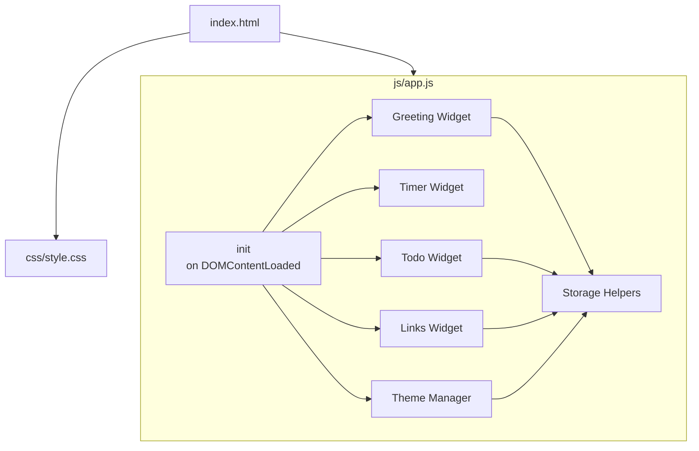

# Design Document: To-Do Life Dashboard

## Overview

The To-Do Life Dashboard is a single-page web application (SPA) built with plain HTML, CSS, and Vanilla JavaScript. It runs entirely in the browser with zero backend dependencies, persisting all state via the `localStorage` API. The app is composed of four interactive widgets — Greeting, Timer, Todo, and Links — plus a global theme toggle and user-name setting.

The design prioritises simplicity: one HTML file, one CSS file, one JS file. No build tools, no frameworks, no external dependencies.

---

## Architecture

The application follows a **widget-based, event-driven architecture** within a single JavaScript module. Each widget owns its own DOM subtree, its own state, and its own storage key. A thin shared layer handles storage reads/writes and theme initialisation.



**Data flow:**
1. On page load, `init()` reads all persisted state from `localStorage` and hydrates each widget.
2. User interactions trigger widget-local event handlers that update in-memory state, re-render the relevant DOM fragment, and write back to `localStorage`.
3. The timer uses `setInterval` for its countdown; the greeting clock uses a separate `setInterval` for the live time display.

---

## Components and Interfaces

### Greeting Widget

Responsible for displaying the live clock, date, and personalised greeting.

```
greetingWidget
  ├── init()          — reads stored name, starts clock interval
  ├── tick()          — called every 1 000 ms, updates time/date/greeting DOM
  ├── getGreeting(hour: number): string
  └── formatDate(date: Date): string
```

- `getGreeting(hour)` maps hour ranges to greeting strings per requirements 1.3–1.6.
- Clock interval is started once and never cleared (lives for the page lifetime).

### Timer Widget

Implements the 25-minute Pomodoro countdown.

```
timerWidget
  ├── init()          — sets remaining = 1500, renders display, binds buttons
  ├── start()         — starts setInterval, updates button states
  ├── stop()          — clears interval, updates button states
  ├── reset()         — stops timer, restores remaining = 1500, re-renders
  ├── tick()          — decrements remaining; calls onComplete() at 0
  ├── onComplete()    — stops timer, shows completion indicator
  ├── render()        — formats MM:SS and writes to DOM
  └── setButtonStates(running: boolean)
```

State: `{ remaining: number, intervalId: number | null }` — kept in memory only (not persisted).

### Todo Widget

Manages the task list with add, edit, complete, and delete operations.

```
todoWidget
  ├── init()          — loads tasks from storage, renders list
  ├── addTask(label: string): Result
  ├── editTask(id: string, newLabel: string): Result
  ├── toggleTask(id: string)
  ├── deleteTask(id: string)
  ├── validateLabel(label: string, excludeId?: string): ValidationResult
  ├── renderList()    — full re-render of task list DOM
  ├── renderTask(task: Task): HTMLElement
  └── persist()       — serialises tasks array to localStorage
```

`Result = { ok: boolean, error?: string }`

### Links Widget

Manages the quick-links panel.

```
linksWidget
  ├── init()          — loads links from storage, renders panel
  ├── addLink(label: string, url: string): Result
  ├── deleteLink(id: string)
  ├── validateLink(label: string, url: string): ValidationResult
  ├── renderPanel()   — full re-render of links DOM
  ├── renderLink(link: Link): HTMLElement
  └── persist()       — serialises links array to localStorage
```

### Theme Manager

```
themeManager
  ├── init()          — reads stored theme, applies class to <body>, no flash
  ├── toggle()        — flips theme, persists, updates toggle button label
  └── apply(theme: 'light' | 'dark')
```

Theme is applied by toggling a `data-theme="dark"` attribute on `<html>` before first paint (inline `<script>` in `<head>`).

### Storage Helpers

```
storage
  ├── get(key: string): any | null
  ├── set(key: string, value: any): void
  └── remove(key: string): void
```

All reads/writes go through these helpers, which handle `JSON.parse` / `JSON.stringify` and catch any `localStorage` quota errors.

**Storage keys:**

| Key | Value |
|-----|-------|
| `tdl_user_name` | `string` |
| `tdl_tasks` | `Task[]` (JSON) |
| `tdl_links` | `Link[]` (JSON) |
| `tdl_theme` | `'light' \| 'dark'` |

---

## Data Models

### Task

```typescript
interface Task {
  id: string;          // crypto.randomUUID() or Date.now().toString()
  label: string;       // trimmed, non-empty
  completed: boolean;
  createdAt: number;   // Unix timestamp ms
}
```

### Link

```typescript
interface Link {
  id: string;
  label: string;       // trimmed, non-empty
  url: string;         // must start with http:// or https://
  createdAt: number;
}
```

### Theme

```typescript
type Theme = 'light' | 'dark';
```

### Validation Result

```typescript
interface ValidationResult {
  valid: boolean;
  error?: 'EMPTY' | 'DUPLICATE' | 'INVALID_URL';
}
```

---

## Correctness Properties

*A property is a characteristic or behavior that should hold true across all valid executions of a system — essentially, a formal statement about what the system should do. Properties serve as the bridge between human-readable specifications and machine-verifiable correctness guarantees.*


### Property 1: Date formatting contains all required components

*For any* `Date` object, `formatDate(date)` shall produce a string that contains the day of the week, the month name, the day number, and the four-digit year.

**Validates: Requirements 1.2**

---

### Property 2: Greeting maps hour to correct message

*For any* integer hour in [0, 23], `getGreeting(hour)` shall return exactly one of "Good morning", "Good afternoon", "Good evening", or "Good night", and the returned value shall match the time-range rules: [5–11] → morning, [12–17] → afternoon, [18–21] → evening, [22–23] and [0–4] → night.

**Validates: Requirements 1.3, 1.4, 1.5, 1.6**

---

### Property 3: Greeting with name appends name correctly

*For any* non-empty name string and any integer hour in [0, 23], the full greeting string shall end with `, {name}` (comma-space followed by the name).

**Validates: Requirements 1.7**

---

### Property 4: Saving a non-empty name persists it to storage

*For any* non-empty, non-whitespace string submitted as the User_Name, `storage.get('tdl_user_name')` shall equal that string after the save operation.

**Validates: Requirements 2.2**

---

### Property 5: Saving a whitespace-only name clears storage

*For any* string composed entirely of whitespace characters, submitting it as the User_Name shall result in `storage.get('tdl_user_name')` returning `null` or an empty value.

**Validates: Requirements 2.4**

---

### Property 6: Timer display is always valid MM:SS format

*For any* integer `n` in [0, 1500], `formatTime(n)` shall return a string matching the pattern `MM:SS` where MM and SS are zero-padded two-digit numbers and SS is in [00, 59].

**Validates: Requirements 3.7**

---

### Property 7: Timer reset always restores to 1500 regardless of state

*For any* timer state (any remaining value in [0, 1500], running or paused), calling `reset()` shall set remaining to 1500 and stop the countdown.

**Validates: Requirements 3.5**

---

### Property 8: Adding a valid task grows the list and persists it

*For any* non-empty, non-duplicate task label, calling `addTask(label)` shall increase the task list length by exactly 1, and `storage.get('tdl_tasks')` shall contain a task with that label.

**Validates: Requirements 4.2**

---

### Property 9: Whitespace-only task labels are rejected

*For any* string composed entirely of whitespace characters, `addTask(label)` shall return `{ ok: false }` and the task list shall remain unchanged.

**Validates: Requirements 4.3**

---

### Property 10: Duplicate task labels are rejected (case-insensitive)

*For any* task already in the list, submitting the same label with any combination of upper/lower case characters shall cause `addTask` to return `{ ok: false }` and leave the task list unchanged.

**Validates: Requirements 4.4**

---

### Property 11: Editing a task with a valid label updates and persists it

*For any* task in the list and any valid new label (non-empty, non-duplicate), `editTask(id, newLabel)` shall update the task's label to `newLabel` and persist the updated list to storage.

**Validates: Requirements 5.3**

---

### Property 12: Editing with whitespace-only label is rejected

*For any* task in the list and any whitespace-only string, `editTask(id, label)` shall return `{ ok: false }` and the task's label shall remain unchanged.

**Validates: Requirements 5.4**

---

### Property 13: Editing with a duplicate label is rejected (case-insensitive)

*For any* task in the list, editing it to a label that matches another existing task (case-insensitive) shall cause `editTask` to return `{ ok: false }` and leave the task's label unchanged.

**Validates: Requirements 5.5**

---

### Property 14: Toggling task completion is a round-trip

*For any* task, calling `toggleTask(id)` twice shall return the task to its original `completed` state, and each toggle shall persist the updated state to storage.

**Validates: Requirements 6.2**

---

### Property 15: Deleting a task removes it from the list and storage

*For any* task id present in the list, calling `deleteTask(id)` shall result in no task with that id remaining in the list, and storage shall reflect the removal.

**Validates: Requirements 6.5**

---

### Property 16: Task list persistence round-trip

*For any* array of tasks written to `localStorage` under `tdl_tasks`, calling `todoWidget.init()` shall render exactly those tasks (same ids, labels, and completion states).

**Validates: Requirements 7.1, 7.3**

---

### Property 17: Adding a valid link grows the list and persists it

*For any* non-empty label and URL starting with `http://` or `https://`, calling `addLink(label, url)` shall increase the links list length by exactly 1 and persist the updated list to storage.

**Validates: Requirements 8.2**

---

### Property 18: Empty label or URL is rejected for links

*For any* combination where the label or URL is empty or whitespace-only, `addLink` shall return `{ ok: false }` and the links list shall remain unchanged.

**Validates: Requirements 8.3**

---

### Property 19: Invalid URL scheme is rejected

*For any* URL string that does not begin with `http://` or `https://`, `addLink` shall return `{ ok: false }` and the links list shall remain unchanged.

**Validates: Requirements 8.4**

---

### Property 20: Link list persistence round-trip

*For any* array of links written to `localStorage` under `tdl_links`, calling `linksWidget.init()` shall render exactly those links (same ids, labels, and URLs).

**Validates: Requirements 8.6**

---

### Property 21: Deleting a link removes it from the list and storage

*For any* link id present in the list, calling `deleteLink(id)` shall result in no link with that id remaining in the list, and storage shall reflect the removal.

**Validates: Requirements 9.2**

---

### Property 22: Theme toggle is a round-trip and persists

*For any* starting theme (`'light'` or `'dark'`), calling `themeManager.toggle()` twice shall return the active theme to its original value, and after each toggle `storage.get('tdl_theme')` shall equal the newly active theme.

**Validates: Requirements 10.2, 10.3**

---

## Error Handling

| Scenario | Handling |
|----------|----------|
| `localStorage` unavailable (private browsing, quota exceeded) | `storage.set` catches the exception and logs a console warning; the app continues to function in-memory for the session |
| Empty / whitespace task or link input | Inline validation message shown; submission blocked |
| Duplicate task label | Inline duplicate-warning message shown; submission blocked |
| Invalid URL scheme | Inline URL-format message shown; submission blocked |
| Timer reaches 0 | `onComplete()` stops the interval and adds a visual "Session complete" indicator; no error state |
| Unknown stored theme value | Falls back to `'light'` |

All validation errors are surfaced as inline messages adjacent to the relevant input field. No modal dialogs or alerts are used.

---

## Testing Strategy

### Unit Tests (example-based)

Focus on specific behaviors, state transitions, and edge cases:

- Greeting widget: clock tick updates DOM, greeting without name has no suffix, empty-state on load
- Timer widget: init shows 25:00, start/stop/reset state transitions, button enable/disable states, completion at 0
- Todo widget: input cleared after add, edit mode shows pre-populated input, cancel discards changes, empty-state message when list is empty, completed task has correct CSS class
- Links widget: link opens in new tab (`target="_blank"`), empty-state when no links
- Theme manager: default light theme when no storage value, correct `data-theme` attribute applied on load

### Property-Based Tests

Use a property-based testing library (e.g., **fast-check** for JavaScript) with a minimum of **100 iterations per property**.

Each test must be tagged with a comment in the format:
`// Feature: todo-life-dashboard, Property {N}: {property_text}`

Properties to implement (referencing the Correctness Properties section above):

| Property | Test focus |
|----------|-----------|
| 1 | `formatDate` output contains all date components |
| 2 | `getGreeting` maps every hour to the correct greeting |
| 3 | Greeting with name always appends `, {name}` |
| 4 | Non-empty name save persists to storage |
| 5 | Whitespace-only name clears storage |
| 6 | `formatTime` always produces valid MM:SS |
| 7 | `reset()` always restores to 1500 from any state |
| 8 | Valid task add grows list and persists |
| 9 | Whitespace task label rejected |
| 10 | Duplicate task label rejected (case-insensitive) |
| 11 | Valid task edit updates label and persists |
| 12 | Whitespace edit label rejected |
| 13 | Duplicate edit label rejected (case-insensitive) |
| 14 | Toggle completion is a round-trip |
| 15 | Delete task removes from list and storage |
| 16 | Task list persistence round-trip |
| 17 | Valid link add grows list and persists |
| 18 | Empty label/URL rejected |
| 19 | Invalid URL scheme rejected |
| 20 | Link list persistence round-trip |
| 21 | Delete link removes from list and storage |
| 22 | Theme toggle is a round-trip and persists |

### Integration / Smoke Tests

- File structure: verify `index.html`, `css/style.css`, `js/app.js` exist
- Full page load: open in browser, verify all four widgets render
- Cross-browser: manual verification in Chrome, Firefox, Edge, Safari
- Performance: Lighthouse audit for load time < 3 s
